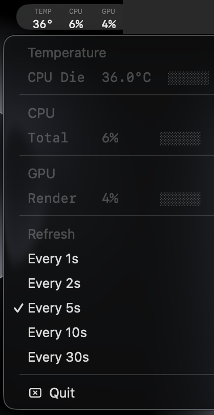

# ThermalBar

A minimal macOS menu bar app that shows CPU temperature, CPU usage, and GPU usage at a glance.



Temperature color shifts from neutral → orange → red as heat rises.

## Features

- **CPU temperature** — Apple Silicon (M1–M4) via IOHIDEventSystem; Intel via SMC
- **CPU usage** — system-wide, via `host_statistics`
- **GPU usage** — via IOKit `IOAccelerator` PerformanceStatistics
- **Heat color** — neutral below 50 °C, orange at 70 °C, red at 90 °C
- **Adjustable refresh interval** — 1 / 2 / 5 / 10 / 30 seconds, set from the menu
- No Dock icon, no background processes — pure menu bar utility
- ~40 MB RSS, 0% CPU between refreshes

## Requirements

- macOS 13 or later
- Apple Silicon or Intel Mac

## Build

```bash
git clone https://github.com/YOUR_USERNAME/ThermalBar.git
cd ThermalBar
swift build -c release
```

### Package as .app

```bash
APP="ThermalBar.app"
mkdir -p "$APP/Contents/MacOS" "$APP/Contents/Resources"
cp .build/release/ThermalBar "$APP/Contents/MacOS/ThermalBar"
cp Sources/ThermalBar/Info.plist "$APP/Contents/Info.plist"
codesign --force --deep --sign - "$APP"
```

Then move `ThermalBar.app` to `/Applications` and double-click to launch.

If macOS shows "cannot verify developer", right-click → Open → Open.

To launch at login: **System Settings → General → Login Items → add ThermalBar**.

## How it works

```
┌─────────────────────────────────────────────────┐
│  NSStatusItem (menu bar button)                 │
│  ┌──────────┬──────────┬──────────┐             │
│  │  TEMP    │   CPU    │   GPU    │  ← 7pt      │
│  │  40°     │   9%     │   12%    │  ← 11pt     │
│  └──────────┴──────────┴──────────┘             │
└─────────────────────────────────────────────────┘
         │
         │ Timer (every N seconds)
         ▼
┌─────────────────────┐
│ IOHIDThermalReader  │  Apple Silicon: dlopen IOKit,
│                     │  IOHIDEventSystemClient → tdie sensors
│ SMCReader           │  Intel fallback: IOConnectCallStructMethod
│                     │  on AppleSMC service
│ CPUMonitor          │  host_statistics HOST_CPU_LOAD_INFO
│                     │  Δticks (user+sys) / Δtotal
│ GPUMonitor          │  IOAccelerator PerformanceStatistics dict
└─────────────────────┘
```

### Temperature source (Apple Silicon)

Apple Silicon does not expose temperatures via SMC. Instead they appear as `IOHIDEventService` entries with sensor names like `PMU tdie1`–`PMU tdie14`. The app reads all `tdie` sensors and reports the maximum.

The technique is adapted from [exelban/Stats](https://github.com/exelban/stats).

## License

MIT
